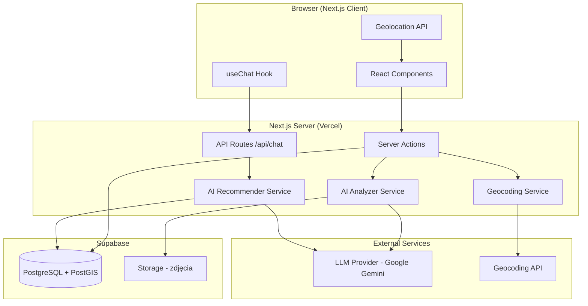
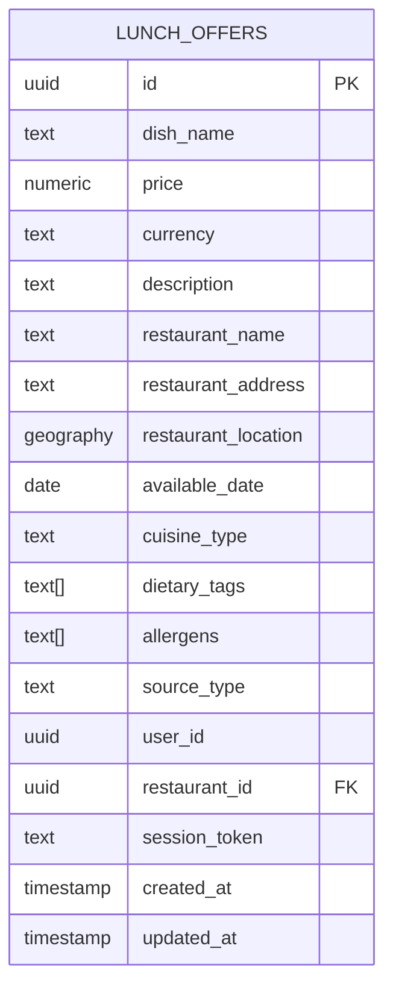

# Design Document: Lunch Agregator

## Overview

Lunch Agregator to aplikacja webowa zbudowana w Next.js (App Router) z TypeScript, wykorzystująca Supabase jako bazę danych (PostgreSQL + PostGIS) oraz Vercel AI SDK do analizy treści i rekomendacji. Aplikacja umożliwia przeglądanie, filtrowanie i geolokalizację bez logowania, a także korzystanie z czatu AI do rekomendacji posiłków. Dodawanie i zarządzanie ofertami wymaga konta.

### Kluczowe decyzje architektoniczne

- **Konto wymagane do zapisu** — przeglądanie, filtrowanie, geolokalizacja i czat AI są dostępne dla odwiedzającego bez konta; dodawanie i zarządzanie ofertami wymaga zalogowanego konta. Własność oferty ustala się po zalogowanym użytkowniku, nigdy po tokenie sesji (patrz `.kiro/specs/user-authentication/`)
- **Server Components + Server Actions** — renderowanie listy ofert po stronie serwera, interakcje (filtrowanie, czat) po stronie klienta
- **PostGIS** — obliczanie odległości i filtrowanie przestrzenne bezpośrednio w bazie danych
- **Vercel AI SDK `generateObject`** — ekstrakcja strukturalnych danych z linków/tekstu/zdjęć
- **Vercel AI SDK `useChat` + `streamText`** — czat rekomendacyjny ze streamingiem odpowiedzi
- **Geocoding** — Nominatim/OpenStreetMap do konwersji adresów na współrzędne

## Ustalone decyzje

### Dostawca AI

Oba serwisy — `AIAnalyzerService` i `AIRecommenderService` — używają **jednego** dostawcy i **jednego** modelu: Google Gemini `gemini-3.8-flash`, przypiętego jako jedna stała `AI_MODEL_ID` w `src/lib/ai/models.ts` z opcjonalnym nadpisaniem przez `AI_MODEL`. Jedna stała, nie jedna na serwis — dwie stałe o tej samej wartości to martwa abstrakcja.

- **Thinking wyłączony** (`thinkingBudget: 0`) na wszystkich czterech ścieżkach. Ekstrakcja strukturalna na schemacie Zod nie ma czego rozumować, a rekomendacja operuje na gotowej liście ofert. Thinking tylko wydłuża czas przy budżecie 10 sekund.
- **Timeout 10 sekund**, zgodnie z Requirement 4.2. Jedna wartość w `src/lib/ai/constants.ts`, żeby oba serwisy nie rozjechały się.
- **429 jest oczekiwanym stanem, nie wyjątkiem.** Limity darmowego tiera (RPM/TPM/RPD) nie są publikowane, liczone są per projekt, nie per klucz, i dzielone między deweloperów. Brak obsługi sprawiałby, że odrzucenie wygląda identycznie jak „model nic nie znalazł". Analyzer zwraca pustą ekstrakcję z komunikatem, który `/add` pokazuje zamiast swojego ogólnego tekstu; okno czatu pokazuje go zamiast ogólnego błędu.

### Geokodowanie po stronie serwera, przed `INSERT`

Geokodowanie ofertowy się w `createOffer` i `createOffersBatchAction`, **przed** wstawieniem wiersza, tylko gdy adres jest obecny i współrzędnych brak. Wcześniejsza implementacja geokodowała po `INSERT` i odrzucała wynik, przez co każda oferta dodana przez AI miała trwale `restaurant_location IS NULL` i była nieosiągalna dla Requirements 1.1 i 6.5 — dokładnie dla przepływu, który generuje większość ofert.

Jeden kod ścieżki dla zapisu pojedynczego i wsadowego, brak stanu pośredniego do uzgadniania, a serwer zna wynik, więc Requirement 6.5 da się spełnić. Klient nie może zapisywać współrzędnych: `restaurantLocation` nie należy do schematu wejściowego.

### Ryzyka i ograniczenia

**Polityka użycia Nominatim.** Geocoding wymaga identyfikacji klienta, ogranicza się do ok. 1 zapytania na sekundę i nie gwarantuje dostępności (brak SLA). To przyjęte ograniczenie, nie do rozwiązania w tym zakresie. Łagodzenie na wypadek wzrostu wolumenu: cache po `restaurant_address`.

**Darmowy tier AI.** Treści użytkowników, w tym zdjęcia menu z Requirement 5.3, są wykorzystywane do ulepszania produktów Google. Przyjęty koszt ograniczenia do darmowego tiera.

**Poza zakresem: atomowość usuwania restauracji.** `deleteRestaurant` to cztery kolejne wywołania Supabase bez transakcji, więc awaria w połowie zostawia oferty z nową nazwą, starym adresem i wyzerowanym kluczem obcym. `RestaurantDetail` filtruje tylko po `restaurant_id`, więc raportuje „brak aktywnych ofert", mimo że oferty dopasowane po migawce istnieją. To należy do Requirements 3.3/3.4/6.5 specyfikacji `restaurant-management`, a nie do tego dokumentu.

### Stan filtrów w URL

URL jest **jedynym** źródłem prawdy dla filtrów. Komponenty czytają z `useSearchParams`, zapisują przez router, a `app/page.tsx` przyjmuje `searchParams` i renderuje poprawnie na pierwszym renderze. Druga instancja prawdy wymagałaby synchronizacji w obie strony, a każdy wynikający z tego błąd to „URL i stan się rozjechały".

**Współrzędne nie są częścią URL.** Trzymane są w ciasteczku `lunchagregator_location` (`httpOnly`, `secure` na produkcji, `sameSite=lax`, 30 dni — zgodnie z domyślną długością sesji Supabase). Serwer czyta je w `page.tsx` i przekazuje klientowi jako prop.

Powód: query string trafia do historii przeglądarki, logów serwera, analityki i nagłówka `Referer` przy każdym wyjściu na stronę zewnętrzną — a link do restauracji w ofercie jest dokładnie takim wyjściem. `httpOnly` jest tu poprawą, a nie kosztem: dziś te dane leżą w `localStorage`, czytelnym przez każdy skrypt na stronie.

**Przetwarzanie:** `offerFiltersSchema` z `src/lib/validations/filters.ts` jest punktem parsowania. Nie powstaje drugi schemat — gdyby istniały dwa, jeden z nich w końcu przestanie być aktualizowany.

**Polityka historii różni się per kontrola, ale źródło prawdy jest jedno.** Chipy, sortowanie, dzień i strona używają `router.push`, żeby „wróć" cofnęło ostatnią zmianę. Pole wyszukiwania używa `router.replace` z debounce — inaczej każde naciśnięcie klawisza tworzyłoby wpis w historii.

**Zmiana dowolnego filtra poza numerem strony resetuje stronę do 1.** Inaczej użytkownik ląduje na stronie 5, której nie ma.

**Brak lokalizacji nie usuwa parametrów z URL.** `sort=distance` i `radius=5` zostają, a strona wyjaśnia, że filtrowanie po odległości wymaga lokalizacji, i proponuje geolokalizację albo wpisanie adresu — tak jak robi to dziś `LocationIndicator`. Usuwanie parametrów psułoby link przy ponownym udostępnieniu, a `permissionState` ma trzy wartości (`granted`, `denied`, `prompt`), których serwer nie widzi żadnej — usuwanie w trakcie pytania o zgodę zgubiłoby filtry, zanim użytkownik zdążyłby kliknąć „zezwól".

**Filtry przeżywają logowanie.** Strony `/auth/*` już przenoszą `?redirectTo=`; dokłada się filtry, żeby zalogowany użytkownik wrócił do filtrowanej listy.

**Poza zakresem: `/restaurants`.** `RestaurantsPage` ma własny zestaw filtrów i własną wersję tego samego problemu — `restaurants/page.tsx` wywołuje `listRestaurants({})`, ignorując wszystko. Mechanizm jest identyczny, więc przeniesienie jest kodem, a nie nową decyzją. Robienie obu naraz oznaczałoby każdą zmianę mechanizmu dwa razy.

### Przypisanie restauracji, „Moje oferty" i wznowienie (#68)

Ustalone w grillu, zamkniętym komentarzem „Settled". Dwie decyzje sterujące: **restauracja-first** (każda publikowana oferta ma `restaurant_id`) i **flaga tygodniowa na restauracji** (marker intencji „do odwołania", bez automatyzacji).

**Dopasowanie po ekstrakcji jest deterministyczne.** Po ekstrakcji uruchamia się `searchRestaurants(extractedName)` — istniejące wyszukiwanie `ilike` — z preferencją dla dokładnego trafienia po znormalizowanej nazwie (trim, case-insensitive) wśród wyników. Zero dopasowań AI. Jedno trafienie (albo dokładne wśród wielu) → preselect z potwierdzeniem przez Usera; zero lub niejednoznaczne → **obowiązkowy krok przypisania**: wybór z wyszukiwania albo inline mini-formularz tworzenia restauracji (nazwa prefilled, adres wymagany, geokodowanie po istniejącej ścieżce `createRestaurant`). Zdublowane restauracje między Userami są przyjęte w v1; narzędzie scalania to przyszła decyzja.

**Formularze oferty są przypięte do restauracji.** Wolne pola tekstowe nazwy i adresu znikają z `OfferForm` i `WeeklyMenuPreview`; zamiast nich widok przypiętej restauracji. Przy publikacji snapshot (nazwa, adres, lokalizacja) jest kopiowany na ofertę — **inwariant 6.2 nietknięty**: późniejsza edycja restauracji nie przepisuje opublikowanych ofert, snapshot pozostaje źródłem prawdy dla wyświetlania.

**Flaga: `restaurants.menu_recurs_weekly BOOLEAN NOT NULL DEFAULT FALSE`.** Ustawiana i odwoływana w edycji restauracji (właściciel lub admin, po istniejącej ścieżce `updateRestaurant`) oraz jednym klikiem w podsumowaniu wznowienia. Rola: marker intencji „menu powtarza się co tydzień, do odwołania" i kryterium surfacingu (restauracje z flagą i wygasłym menu na górze „Moje oferty" jako „Menu tygodniowe do odnowienia"). **Zero automatyzacji w v1** — brak crona, brak materializacji w tle; to świadoma decyzja, zapisana także w Req 8.7.

**Wznowienie = okno + `+7`.** Eligible: własne oferty restauracji z `available_date ∈ [dziś−7, dziś+6]`. Każda dostaje `data źródłowa + 7 dni`. Dlaczego nie `nextDateForDay`: menu pon–pt odnawiane w środku tygodnia podniosłoby tylko wygasłe pon/wt i gubiąc śr–pt na kolejny tydzień; `+7` zachowuje strukturę dni, a okno gwarantuje poprawność (najstarsze źródło ląduje dokładnie na dziś — INSERT akceptuje; najnowsze na dziś+13 ≤ limit 30 dni). Nakładanie się okien jest normalne i obcina je dedupe: wznowienie w poniedziałek mapuje zeszłotygodniowe dania na istniejące wiersze („pomięto — już istnieją"), a bieżący tydzień tworzy następny. Rytm: jedno kliknięcie tygodniowo = pełne menu na kolejny tydzień. `nextDateForDay` zostaje tam, gdzie już żył: publikacja weekly-menu w flow dodawania.

**Miejsce z restauracji, dania z oferty.** Adres snapshot i współrzędne bierze się z bieżącego wiersza restauracji — **zero geokodowania** (kopiąca ścieżka nie dotyka Nominatim; ustalone w Q3 grilla). Pola dań (nazwa, opis, pozycje, tagi, alergeny, cena) kopiowane verbatim z oferty źródłowej. Restauracja, która się przeprowadziła, publikuje nowy adres; oferta źródłowa bez współrzędnych leczy się, jeśli restauracja je ma.

**Deduplikacja per użytkownik.** Klucz: `restaurant_id` + `dish_name` + `data docelowa` wśród własnych ofert; pominięte pozycje trafiają do podsumowania. Globalne ograniczenie unikatowości (indeks) to osobna migracja, nie ukryte zapytanie w akcji — ustalone w Q4.

**Stare oferty bez restauracji są martwe.** Bez migracji, bez czyszczenia, bez doczepiania post-hoc (decyzja #18 obowiązuje). W „Moje oferty" lądują w odrębnej grupie „bez restauracji" z podpowiedzią ponownego dodania przez nowy flow. Admin pozostaje narzędziem backlogu (#54–#56).
**Zmienione w #74:** doczepianie jest dostępne — kafelek „Bez restauracji" subgrupuje po nazwie snapshota, a jedna decyzja przypisuje całą grupę. Węższa zasada: **attach-when-null tylko** (nigdy przepiąć, nigdy odwiązać — #18 w mocy), snapshot bez zmian (Req 6.2).

**Poza zakresem v1 (świadomie):** automatyczna materializacja menu (cron/pg_cron), digesty e-mail, scalanie zdublowanych restauracji, globalne ograniczenie unikatowości ofert, doczepianie restauracji do starych ofert.

## Architecture

### Diagram wysokopoziomowy



### Przepływ danych

1. **Przeglądanie ofert**: Client → Server Component (SSR) → Supabase query z PostGIS → HTML response
2. **Filtrowanie**: Client (state) → Server Action → Supabase query z filtrami → JSON response
3. **Dodawanie oferty**: Client (input) → Server Action → AI Analyzer → Structured data → User review → Supabase insert
4. **Czat AI**: Client (useChat) → API Route `/api/chat` → streamText z kontekstem ofert → Streaming response
5. **Geolokalizacja**: Browser Geolocation API → Client state → przekazanie do zapytań

## Components and Interfaces

### 1. Warstwa prezentacji (React Components)

```typescript
// Główne komponenty stron
app/
├── page.tsx                    // Strona główna - lista ofert (Server Component)
├── offers/[id]/page.tsx        // Szczegóły oferty
├── add/page.tsx                // Formularz dodawania oferty
├── chat/page.tsx               // Czat rekomendacyjny
└── layout.tsx                  // Layout z nawigacją

// Komponenty współdzielone
components/
├── offers/
│   ├── OfferCard.tsx           // Karta oferty na liście
│   ├── OfferList.tsx           // Lista ofert z paginacją
│   ├── OfferDetails.tsx        // Pełne szczegóły oferty
│   └── OfferFilters.tsx        // Panel filtrów i sortowania
├── add-offer/
│   ├── InputSelector.tsx       // Wybór typu inputu (link/tekst/zdjęcie)
│   ├── OfferPreview.tsx        // Podgląd wyekstrahowanej oferty
│   └── OfferForm.tsx           // Formularz edycji/potwierdzenia
├── chat/
│   ├── ChatWindow.tsx          // Okno czatu
│   ├── ChatMessage.tsx         // Pojedyncza wiadomość
│   └── RecommendationCard.tsx  // Karta rekomendowanej oferty
├── location/
│   ├── LocationPrompt.tsx      // Prompt geolokalizacji
│   └── AddressInput.tsx        // Ręczne wpisywanie adresu
└── ui/                         // Bazowe komponenty UI (shadcn/ui)
```

### 2. Warstwa logiki serwerowej

```typescript
// Server Actions
actions/
├── offers.ts                   // CRUD ofert, filtrowanie
├── analyze.ts                  // Analiza AI inputu użytkownika
├── geocode.ts                  // Geocoding adresów
└── session.ts                  // Zarządzanie tokenem sesji

// API Routes
app/api/
├── chat/route.ts               // Endpoint czatu AI (streaming)
└── upload/route.ts             // Upload zdjęć do Supabase Storage
```

### 3. Warstwa serwisów

```typescript
// services/
interface AIAnalyzerService {
  analyzeUrl(url: string): Promise<ExtractedOffers>;
  analyzeText(text: string): Promise<ExtractedOffers>;
  analyzeImage(imageUrl: string): Promise<ExtractedOffers>;
}

interface AIRecommenderService {
  getRecommendations(
    messages: Message[],
    availableOffers: LunchOffer[],
    userLocation?: Coordinates
  ): AsyncIterable<StreamPart>;
}

interface GeocodingService {
  geocodeAddress(address: string): Promise<Coordinates | null>;
  calculateDistance(from: Coordinates, to: Coordinates): number;
}

interface OfferService {
  listOffers(filters: OfferFilters, userLocation?: Coordinates): Promise<PaginatedOffers>;
  getOffer(id: string): Promise<LunchOffer | null>;
  createOffer(data: CreateOfferInput, sessionToken: string): Promise<LunchOffer>;
  updateOffer(id: string, data: UpdateOfferInput, sessionToken: string): Promise<LunchOffer>;
  deleteOffer(id: string, sessionToken: string): Promise<void>;
}
```

### 4. Interfejsy kluczowe

```typescript
// Typy filtrów
interface OfferFilters {
  distance?: { radius: number; from: Coordinates };  // 0.5-25 km
  price?: { min: number; max: number };               // 0.01-999.99
  cuisineTypes?: CuisineType[];
  dietaryTags?: DietaryTag[];
  searchQuery?: string;                               // min 2 znaki
  sortBy?: 'price_asc' | 'price_desc' | 'distance' | 'newest';
  page?: number;
  limit?: number;                                     // max 50
}

// Wynik ekstrakcji AI
interface ExtractedOffers {
  offers: ExtractedOffer[];
  sourceType: 'link' | 'text' | 'photo';
  confidence: number;
  missingFields: string[];
}

interface ExtractedOffer {
  restaurantName: string | null;
  dishes: ExtractedDish[];
  address?: string;
}

interface ExtractedDish {
  name: string | null;
  price: number | null;
  description?: string;
  dietaryTags?: DietaryTag[];
  allergens?: Allergen[];
}
```

## Data Models

### Schemat bazy danych (Supabase/PostgreSQL)



### Definicja tabeli SQL

```sql
-- Włączenie PostGIS
CREATE EXTENSION IF NOT EXISTS postgis;

CREATE TABLE lunch_offers (
  id UUID PRIMARY KEY DEFAULT gen_random_uuid(),
  dish_name TEXT NOT NULL CHECK (char_length(dish_name) <= 100),
  price NUMERIC(6,2) NOT NULL CHECK (price >= 0.01 AND price <= 9999.99),
  currency TEXT NOT NULL DEFAULT 'PLN',
  description TEXT CHECK (char_length(description) <= 500),
  restaurant_name TEXT NOT NULL CHECK (char_length(restaurant_name) <= 100),
  restaurant_address TEXT CHECK (char_length(restaurant_address) <= 200),
  restaurant_location GEOGRAPHY(POINT, 4326),
  available_date DATE NOT NULL CHECK (available_date >= CURRENT_DATE AND available_date <= CURRENT_DATE + INTERVAL '30 days'),
  cuisine_type TEXT,
  dietary_tags TEXT[] DEFAULT '{}',
  allergens TEXT[] DEFAULT '{}',
  source_type TEXT NOT NULL CHECK (source_type IN ('link', 'text', 'photo')),
  -- Właściciel oferty. Źródło prawdy dla uprawnień do edycji i usunięcia.
  user_id UUID REFERENCES auth.users(id),
  -- Opcjonalne powiązanie z restaurants; semantyka należy do `restaurant-management`.
  -- Nazwa na ofercie pozostaje autorytatywna dla wyświetlania (Requirement 6.2).
  restaurant_id UUID REFERENCES restaurants(id),
  -- Wycofany mechanizm własności. Przetrwał wyłącznie jako koncept migracji
  -- danych z ery anonimowej; nie jest mechanizmem autoryzacji.
  session_token TEXT,
  created_at TIMESTAMPTZ DEFAULT NOW(),
  updated_at TIMESTAMPTZ DEFAULT NOW()
);

-- Indeksy
CREATE INDEX idx_offers_available_date ON lunch_offers(available_date);
CREATE INDEX idx_offers_price ON lunch_offers(price);
CREATE INDEX idx_offers_cuisine ON lunch_offers(cuisine_type);
CREATE INDEX idx_offers_dietary ON lunch_offers USING GIN(dietary_tags);
CREATE INDEX idx_offers_session ON lunch_offers(session_token);
CREATE INDEX idx_offers_location ON lunch_offers USING GIST(restaurant_location);
CREATE INDEX idx_offers_search ON lunch_offers USING GIN(
  to_tsvector('simple', coalesce(dish_name, '') || ' ' || coalesce(description, ''))
);

-- Funkcja obliczania odległości
CREATE OR REPLACE FUNCTION get_offers_within_radius(
  user_lat DOUBLE PRECISION,
  user_lng DOUBLE PRECISION,
  radius_km DOUBLE PRECISION
)
RETURNS TABLE (
  id UUID,
  dish_name TEXT,
  price NUMERIC,
  description TEXT,
  restaurant_name TEXT,
  distance_km DOUBLE PRECISION
) AS $$
BEGIN
  RETURN QUERY
  SELECT
    lo.id,
    lo.dish_name,
    lo.price,
    lo.description,
    lo.restaurant_name,
    ROUND((ST_Distance(
      lo.restaurant_location,
      ST_SetSRID(ST_MakePoint(user_lng, user_lat), 4326)::geography
    ) / 1000.0)::numeric, 1)::double precision AS distance_km
  FROM lunch_offers lo
  WHERE lo.available_date = CURRENT_DATE
    AND lo.restaurant_location IS NOT NULL
    AND ST_DWithin(
      lo.restaurant_location,
      ST_SetSRID(ST_MakePoint(user_lng, user_lat), 4326)::geography,
      radius_km * 1000
    )
  ORDER BY distance_km ASC;
END;
$$ LANGUAGE plpgsql;
```

### Typy TypeScript (mapowanie z bazy)

```typescript
type CuisineType =
  | 'polska'
  | 'wloska'
  | 'azjatycka'
  | 'meksykanska'
  | 'amerykanska'
  | 'indyjska'
  | 'srodziemnomorska'
  | 'inne';

type DietaryTag = 'vegetarian' | 'vegan' | 'gluten-free' | 'dairy-free' | 'keto';

type Allergen =
  | 'gluten' | 'orzechy' | 'mleko' | 'jaja' | 'ryby'
  | 'skorupiaki' | 'soja' | 'seler' | 'gorczyca' | 'sezam';

interface LunchOffer {
  id: string;
  dishName: string;
  price: number;
  currency: string;
  description: string | null;
  restaurantName: string;
  restaurantAddress: string | null;
  restaurantLocation: Coordinates | null;
  availableDate: string; // ISO date
  cuisineType: CuisineType | null;
  dietaryTags: DietaryTag[];
  allergens: Allergen[];
  sourceType: 'link' | 'text' | 'photo';
  sessionToken: string;
  createdAt: string;
  updatedAt: string;
}

interface Coordinates {
  latitude: number;
  longitude: number;
}

interface PaginatedOffers {
  offers: LunchOfferWithDistance[];
  total: number;
  page: number;
  limit: number;
  hasMore: boolean;
}

interface LunchOfferWithDistance extends LunchOffer {
  distanceKm: number | null;
}
```


## Correctness Properties

*A property is a characteristic or behavior that should hold true across all valid executions of a system — essentially, a formal statement about what the system should do. Properties serve as the bridge between human-readable specifications and machine-verifiable correctness guarantees.*

### Property 1: Listing returns only today's offers with pagination limit

*For any* set of lunch offers in the database with various `available_date` values, calling the listing function SHALL return only offers where `available_date` equals the current date, and the number of returned offers SHALL NOT exceed 50.

**Validates: Requirements 1.1**

### Property 2: Sort order correctness

*For any* list of lunch offers and any selected sort criterion (price ascending, price descending, distance, newest), the returned list SHALL be ordered such that for every adjacent pair (offer[i], offer[i+1]), the sort invariant holds (e.g., offer[i].price <= offer[i+1].price for price ascending).

**Validates: Requirements 1.2, 2.6**

### Property 3: Distance filter invariant

*For any* set of lunch offers with locations, any user location, and any radius value between 0.5 and 25 km, all offers returned by the distance filter SHALL have a straight-line distance from the user location that is less than or equal to the specified radius.

**Validates: Requirements 2.1**

### Property 4: Price filter invariant

*For any* set of lunch offers and any price range [min, max] where 0.01 ≤ min ≤ max ≤ 999.99, all offers returned by the price filter SHALL have a price P where min ≤ P ≤ max.

**Validates: Requirements 2.2**

### Property 5: Cuisine filter (OR logic)

*For any* set of lunch offers and any non-empty subset of cuisine types, all offers returned by the cuisine filter SHALL have a `cuisine_type` that is a member of the selected subset.

**Validates: Requirements 2.3**

### Property 6: Dietary filter (AND logic)

*For any* set of lunch offers and any non-empty subset of dietary tags, all offers returned by the dietary filter SHALL have `dietary_tags` that contain every tag in the selected subset.

**Validates: Requirements 2.4**

### Property 7: Text search containment

*For any* set of lunch offers and any search query of at least 2 characters, all offers returned by the search function SHALL have either `dish_name` or `description` containing the query text (case-insensitive partial match).

**Validates: Requirements 2.5**

### Property 8: Combined filters equal intersection

*For any* set of lunch offers and any combination of active filters, the result of applying all filters simultaneously SHALL be a subset of the result of applying each individual filter alone (i.e., combined result ⊆ intersection of individual results).

**Validates: Requirements 2.7**

### Property 9: Distance calculation correctness

*For any* two geographic coordinate pairs (lat1, lng1) and (lat2, lng2), the calculated straight-line distance SHALL be: (a) non-negative, (b) symmetric — distance(A, B) == distance(B, A), (c) zero when both points are identical, and (d) rounded to one decimal place in kilometers.

**Validates: Requirements 3.4, 3.7**

### Property 10: Description truncation on list view

*For any* lunch offer with a description longer than 150 characters, the list view display function SHALL return a truncated description of exactly 150 characters (or 150 characters plus an ellipsis indicator).

**Validates: Requirements 1.3**

### Property 11: Offer validation — required and optional field constraints

*For any* offer submission input, the validation function SHALL: (a) reject inputs where `dish_name` exceeds 100 characters, `price` is outside [0.01, 9999.99], `restaurant_name` exceeds 100 characters, or `available_date` is in the past or more than 30 days ahead; (b) reject inputs where optional `description` exceeds 500 characters, `dietary_tags` count exceeds 5, `allergens` count exceeds 10, or `restaurant_address` exceeds 200 characters; (c) accept all inputs satisfying these constraints.

**Validates: Requirements 6.2, 6.3, 6.6**

### Property 12: Extraction validation identifies missing fields

*For any* AI extraction result (potentially with null/missing fields), the validation function SHALL correctly identify all fields that are missing from the required set (restaurant name, at least one dish name, price per dish) and return them as a list of missing field names, while pre-filling all successfully extracted fields.

**Validates: Requirements 5.5, 5.8**

### Property 13: Account-based ownership enforcement

*For any* lunch offer and any authenticated account, the system SHALL allow edit and delete operations if and only if the acting account's id matches the offer's stored `user_id`. Ownership is never established by a session token.

**Validates: Requirements 6.7**

### Property 14: Chat session message limit

*For any* chat session, the system SHALL accept messages up to a count of 50 and SHALL reject or trim messages beyond this limit, ensuring no session exceeds 50 messages.

**Validates: Requirements 4.5**

### Przewijanie poziome

**Strona nigdy nie scrolluje się w bok.** Poziomy scroll na poziomie dokumentu na telefonie to wzorzec, którego użytkownik nie oczekuje i nie kontroluje.

**Komponent może przewijać się w bok**, ale tylko wtedy, gdy użytkownik widzi, że jest coś dalej — widoczna krawędź, cień, wskaźnik „jest więcej". Wspólny scroll bez żadnego sygnału wygląda jak treść, która po prostu się urwała.

W praktyce zamiast przewijania używane jest **zawijanie wierszy**. Pasek wyboru dni ma siedem przycisków po 64px; przy 320px dostępne jest 280px, a `7 × 64 + 6 × 8 = 496px`, więc siedem nie mieści się w jednym wierszu przy żadnym rozsądnym rozmiarze etykiety. Zawijanie daje 3 + 3 + 1 wiersze i nic poza widokiem.

**`overflow-x-hidden` na `html`/`body` zostało usunięte.** Nie robiło nic — zmierzone po zneutralizowaniu reguły, przepełnienia strony nie było w żadnej szerokości na żadnej trasie — a jednocześnie uniemożliwiało przetestowanie 7.1, bo dokument nigdy nie zgłasza paska. Ukrywało defekt zamiast go pokazywać.

## Error Handling

### Strategia obsługi błędów

| Warstwa | Typ błędu | Obsługa |
|---------|-----------|---------|
| Client | Brak geolokalizacji | Fallback na sortowanie alfabetyczne + pole adresu |
| Client | Timeout geolokalizacji (>10s) | Komunikat + pole adresu manualnego |
| Client | Błąd walidacji formularza | Podświetlenie pól + komunikaty inline |
| Server | Geocoding failure | Zapis oferty bez współrzędnych + komunikat |
| Server | AI Analyzer failure | Komunikat o brakujących polach + formularz manualny |
| Server | AI Recommender unavailable | Komunikat "usługa tymczasowo niedostępna" |
| Server | AI rate limit (429) | Komunikat "AI jest zajęty, spróbuj ponownie", nie pusta ekstrakcja |
| Server | Supabase connection error | Generyczny komunikat błędu + retry |
| Server | File upload too large (>10MB) | Odrzucenie z komunikatem o limicie |
| Server | Invalid file type | Odrzucenie z listą dozwolonych formatów |

### Wzorce obsługi błędów

```typescript
// Server Action error pattern
type ActionResult<T> = 
  | { success: true; data: T }
  | { success: false; error: string; fieldErrors?: Record<string, string> };

// AI service error handling
// Uwaga: timer jest zawsze czyszczony — bez tego każde udane wywołanie
// zostawiało wiszący timeout do momentu odpalenia. 429 jest odróżnione od
// zwykłej awarii, bo użytkownik musi wiedzieć, że model jest zajęty, a nie
// że nic nie znalazł.
async function withAIFallback<T>(
  aiCall: () => Promise<T>,
  fallback: (message?: string) => T,
  timeoutMs: number = AI_TIMEOUT_MS
): Promise<T> {
  let timer: ReturnType<typeof setTimeout> | undefined;
  try {
    const result = await Promise.race([
      aiCall(),
      new Promise<never>((_, reject) => {
        timer = setTimeout(() => reject(new Error('AI service timeout')), timeoutMs);
      }),
    ]);
    return result;
  } catch (error) {
    console.error('AI service error:', error);
    return isRateLimitError(error) ? fallback(RATE_LIMIT_MESSAGE) : fallback();
  } finally {
    if (timer !== undefined) clearTimeout(timer);
  }
}
```

### Walidacja na wielu warstwach

1. **Client-side** (React Hook Form + Zod): natychmiastowy feedback UX
2. **Server-side** (Server Actions + Zod): autorytarna walidacja
3. **Database** (CHECK constraints): ostatnia linia obrony

## Testing Strategy

### Podejście dwutorowe

#### 1. Testy property-based (fast-check)

Biblioteka: **[fast-check](https://github.com/dubzzz/fast-check)** (TypeScript)

Konfiguracja: minimum 100 iteracji na property test.

Każdy test property-based będzie oznaczony komentarzem:
```typescript
// Feature: lunch-agregator, Property {number}: {property_text}
```

Testy property-based pokrywają:
- Filtrowanie ofert (Properties 3-8)
- Sortowanie (Property 2)
- Walidacja ofert (Property 11)
- Walidacja ekstrakcji (Property 12)
- Obliczanie odległości (Property 9)
- Truncation opisu (Property 10)
- Ownership na koncie (Property 13)
- Limit wiadomości czatu (Property 14)
- Listing invariant (Property 1)

#### 2. Testy unit (example-based)

Biblioteka: **Vitest**

Pokrywają:
- Konkretne scenariusze UI (empty states, prompts)
- Edge cases (timeout geolokalizacji, geocoding failure)
- Integracja z AI (mockowane odpowiedzi)
- Renderowanie komponentów

#### 3. Testy integracyjne

- API routes z mockowanym Supabase
- AI Analyzer z przykładowymi inputami
- Geocoding z mockowanym API
- E2E z Playwright (kluczowe ścieżki użytkownika)

#### 4. Testy responsywności

- Visual regression (Playwright screenshots) na breakpointach: 320px, 768px, 1024px, 1440px, 2560px
- Automated accessibility audit (axe-core)

### Struktura testów

```
__tests__/
├── properties/
│   ├── offer-filtering.property.test.ts
│   ├── offer-validation.property.test.ts
│   ├── distance-calculation.property.test.ts
│   ├── offer-listing.property.test.ts
│   ├── extraction-validation.property.test.ts
│   ├── session-ownership.property.test.ts
│   └── chat-session.property.test.ts
├── unit/
│   ├── services/
│   ├── components/
│   ├── actions/            # server actions against a mocked Supabase client
│   └── utils/
└── e2e/
    └── flows/
```

> **Uwaga o nazewnictwie.** `__tests__/integration/` nie istnieje i nie powstał. Testy, które dawniej tam leżały, to server actions uruchamiane na **mockowanym** kliencie Supabase — bez gniazda, bez zmiennych środowiskowych, bez seedów i bez teardownu. Nazwa katalogu sugerowała pokrycie relacji oferta–restauracja na prawdziwej bazie, a takiego pokrycia nie ma. Trafiły do `unit/actions/`. Testy integracyjne żyją w projekcie `db` (`npm run test:db`, `__tests__/db/`), który łączy się z lokalnym stosem Supabase.
