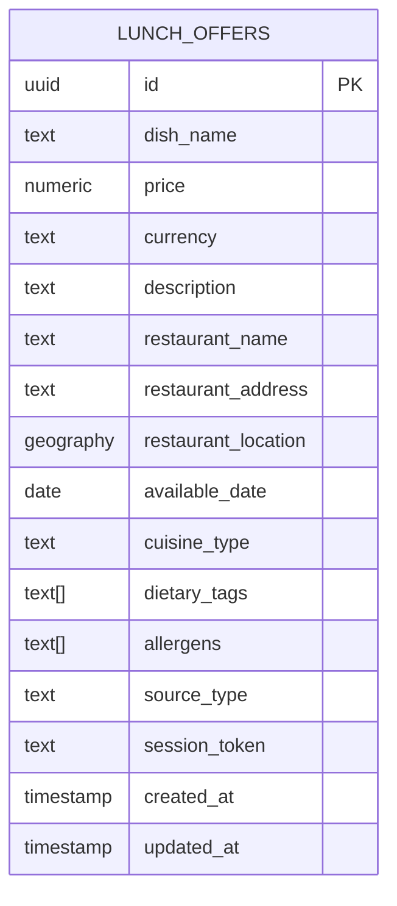

# Design Document: Lunch Agregator

## Overview

Lunch Agregator to aplikacja webowa zbudowana w Next.js (App Router) z TypeScript, wykorzystująca Supabase jako bazę danych (PostgreSQL + PostGIS) oraz Vercel AI SDK do analizy treści i rekomendacji. Aplikacja umożliwia anonimowe przeglądanie, filtrowanie i dodawanie ofert lunchowych, a także korzystanie z czatu AI do rekomendacji posiłków.

### Kluczowe decyzje architektoniczne

- **Brak autentykacji** — anonimowy dostęp z identyfikacją sesji przez token (cookie/localStorage) do zarządzania własnymi ofertami
- **Server Components + Server Actions** — renderowanie listy ofert po stronie serwera, interakcje (filtrowanie, czat) po stronie klienta
- **PostGIS** — obliczanie odległości i filtrowanie przestrzenne bezpośrednio w bazie danych
- **Vercel AI SDK `generateObject`** — ekstrakcja strukturalnych danych z linków/tekstu/zdjęć
- **Vercel AI SDK `useChat` + `streamText`** — czat rekomendacyjny ze streamingiem odpowiedzi
- **Geocoding** — zewnętrzne API (np. Nominatim/OpenStreetMap) do konwersji adresów na współrzędne

## Architecture

### Diagram wysokopoziomowy


### Przepływ danych

1. **Przeglądanie ofert**: Client → Server Component (SSR) → Supabase query z PostGIS → HTML response
2. **Filtrowanie**: Client (state) → Server Action → Supabase query z filtrami → JSON response
3. **Dodawanie oferty**: Client (input) → Server Action → AI Analyzer → Structured data → User review → Supabase insert
4. **Czat AI**: Client (useChat) → API Route `/api/chat` → streamText z kontekstem ofert → Streaming response
5. **Geolokalizacja**: Browser Geolocation API → Client state → przekazanie do zapytań

## Components and Interfaces

### 1. Warstwa prezentacji (React Components)

```typescript
// Główne komponenty stron
app/
├── page.tsx                    // Strona główna - lista ofert (Server Component)
├── offers/[id]/page.tsx        // Szczegóły oferty
├── add/page.tsx                // Formularz dodawania oferty
├── chat/page.tsx               // Czat rekomendacyjny
└── layout.tsx                  // Layout z nawigacją

// Komponenty współdzielone
components/
├── offers/
│   ├── OfferCard.tsx           // Karta oferty na liście
│   ├── OfferList.tsx           // Lista ofert z paginacją
│   ├── OfferDetails.tsx        // Pełne szczegóły oferty
│   └── OfferFilters.tsx        // Panel filtrów i sortowania
├── add-offer/
│   ├── InputSelector.tsx       // Wybór typu inputu (link/tekst/zdjęcie)
│   ├── OfferPreview.tsx        // Podgląd wyekstrahowanej oferty
│   └── OfferForm.tsx           // Formularz edycji/potwierdzenia
├── chat/
│   ├── ChatWindow.tsx          // Okno czatu
│   ├── ChatMessage.tsx         // Pojedyncza wiadomość
│   └── RecommendationCard.tsx  // Karta rekomendowanej oferty
├── location/
│   ├── LocationPrompt.tsx      // Prompt geolokalizacji
│   └── AddressInput.tsx        // Ręczne wpisywanie adresu
└── ui/                         // Bazowe komponenty UI (shadcn/ui)
```

### 2. Warstwa logiki serwerowej

```typescript
// Server Actions
actions/
├── offers.ts                   // CRUD ofert, filtrowanie
├── analyze.ts                  // Analiza AI inputu użytkownika
├── geocode.ts                  // Geocoding adresów
└── session.ts                  // Zarządzanie tokenem sesji

// API Routes
app/api/
├── chat/route.ts               // Endpoint czatu AI (streaming)
└── upload/route.ts             // Upload zdjęć do Supabase Storage
```

### 3. Warstwa serwisów

```typescript
// services/
interface AIAnalyzerService {
  analyzeUrl(url: string): Promise<ExtractedOffers>;
  analyzeText(text: string): Promise<ExtractedOffers>;
  analyzeImage(imageUrl: string): Promise<ExtractedOffers>;
}

interface AIRecommenderService {
  getRecommendations(
    messages: Message[],
    availableOffers: LunchOffer[],
    userLocation?: Coordinates
  ): AsyncIterable<StreamPart>;
}

interface GeocodingService {
  geocodeAddress(address: string): Promise<Coordinates | null>;
  calculateDistance(from: Coordinates, to: Coordinates): number;
}

interface OfferService {
  listOffers(filters: OfferFilters, userLocation?: Coordinates): Promise<PaginatedOffers>;
  getOffer(id: string): Promise<LunchOffer | null>;
  createOffer(data: CreateOfferInput, sessionToken: string): Promise<LunchOffer>;
  updateOffer(id: string, data: UpdateOfferInput, sessionToken: string): Promise<LunchOffer>;
  deleteOffer(id: string, sessionToken: string): Promise<void>;
}
```

### 4. Interfejsy kluczowe

```typescript
// Typy filtrów
interface OfferFilters {
  distance?: { radius: number; from: Coordinates };  // 0.5-25 km
  price?: { min: number; max: number };               // 0.01-999.99
  cuisineTypes?: CuisineType[];
  dietaryTags?: DietaryTag[];
  searchQuery?: string;                               // min 2 znaki
  sortBy?: 'price_asc' | 'price_desc' | 'distance' | 'newest';
  page?: number;
  limit?: number;                                     // max 50
}

// Wynik ekstrakcji AI
interface ExtractedOffers {
  offers: ExtractedOffer[];
  sourceType: 'link' | 'text' | 'photo';
  confidence: number;
  missingFields: string[];
}

interface ExtractedOffer {
  restaurantName: string | null;
  dishes: ExtractedDish[];
  address?: string;
}

interface ExtractedDish {
  name: string | null;
  price: number | null;
  description?: string;
  dietaryTags?: DietaryTag[];
  allergens?: Allergen[];
}
```

## Data Models

### Schemat bazy danych (Supabase/PostgreSQL)



### Definicja tabeli SQL

```sql
-- Włączenie PostGIS
CREATE EXTENSION IF NOT EXISTS postgis;

CREATE TABLE lunch_offers (
  id UUID PRIMARY KEY DEFAULT gen_random_uuid(),
  dish_name TEXT NOT NULL CHECK (char_length(dish_name) <= 100),
  price NUMERIC(6,2) NOT NULL CHECK (price >= 0.01 AND price <= 9999.99),
  currency TEXT NOT NULL DEFAULT 'PLN',
  description TEXT CHECK (char_length(description) <= 500),
  restaurant_name TEXT NOT NULL CHECK (char_length(restaurant_name) <= 100),
  restaurant_address TEXT CHECK (char_length(restaurant_address) <= 200),
  restaurant_location GEOGRAPHY(POINT, 4326),
  available_date DATE NOT NULL CHECK (available_date >= CURRENT_DATE AND available_date <= CURRENT_DATE + INTERVAL '30 days'),
  cuisine_type TEXT,
  dietary_tags TEXT[] DEFAULT '{}',
  allergens TEXT[] DEFAULT '{}',
  source_type TEXT NOT NULL CHECK (source_type IN ('link', 'text', 'photo')),
  session_token TEXT NOT NULL,
  created_at TIMESTAMPTZ DEFAULT NOW(),
  updated_at TIMESTAMPTZ DEFAULT NOW()
);

-- Indeksy
CREATE INDEX idx_offers_available_date ON lunch_offers(available_date);
CREATE INDEX idx_offers_price ON lunch_offers(price);
CREATE INDEX idx_offers_cuisine ON lunch_offers(cuisine_type);
CREATE INDEX idx_offers_dietary ON lunch_offers USING GIN(dietary_tags);
CREATE INDEX idx_offers_session ON lunch_offers(session_token);
CREATE INDEX idx_offers_location ON lunch_offers USING GIST(restaurant_location);
CREATE INDEX idx_offers_search ON lunch_offers USING GIN(
  to_tsvector('simple', coalesce(dish_name, '') || ' ' || coalesce(description, ''))
);

-- Funkcja obliczania odległości
CREATE OR REPLACE FUNCTION get_offers_within_radius(
  user_lat DOUBLE PRECISION,
  user_lng DOUBLE PRECISION,
  radius_km DOUBLE PRECISION
)
RETURNS TABLE (
  id UUID,
  dish_name TEXT,
  price NUMERIC,
  description TEXT,
  restaurant_name TEXT,
  distance_km DOUBLE PRECISION
) AS $$
BEGIN
  RETURN QUERY
  SELECT
    lo.id,
    lo.dish_name,
    lo.price,
    lo.description,
    lo.restaurant_name,
    ROUND((ST_Distance(
      lo.restaurant_location,
      ST_SetSRID(ST_MakePoint(user_lng, user_lat), 4326)::geography
    ) / 1000.0)::numeric, 1)::double precision AS distance_km
  FROM lunch_offers lo
  WHERE lo.available_date = CURRENT_DATE
    AND lo.restaurant_location IS NOT NULL
    AND ST_DWithin(
      lo.restaurant_location,
      ST_SetSRID(ST_MakePoint(user_lng, user_lat), 4326)::geography,
      radius_km * 1000
    )
  ORDER BY distance_km ASC;
END;
$$ LANGUAGE plpgsql;
```

### Typy TypeScript (mapowanie z bazy)

```typescript
type CuisineType =
  | 'polska'
  | 'wloska'
  | 'azjatycka'
  | 'meksykanska'
  | 'amerykanska'
  | 'indyjska'
  | 'srodziemnomorska'
  | 'inne';

type DietaryTag = 'vegetarian' | 'vegan' | 'gluten-free' | 'dairy-free' | 'keto';

type Allergen =
  | 'gluten' | 'orzechy' | 'mleko' | 'jaja' | 'ryby'
  | 'skorupiaki' | 'soja' | 'seler' | 'gorczyca' | 'sezam';

interface LunchOffer {
  id: string;
  dishName: string;
  price: number;
  currency: string;
  description: string | null;
  restaurantName: string;
  restaurantAddress: string | null;
  restaurantLocation: Coordinates | null;
  availableDate: string; // ISO date
  cuisineType: CuisineType | null;
  dietaryTags: DietaryTag[];
  allergens: Allergen[];
  sourceType: 'link' | 'text' | 'photo';
  sessionToken: string;
  createdAt: string;
  updatedAt: string;
}

interface Coordinates {
  latitude: number;
  longitude: number;
}

interface PaginatedOffers {
  offers: LunchOfferWithDistance[];
  total: number;
  page: number;
  limit: number;
  hasMore: boolean;
}

interface LunchOfferWithDistance extends LunchOffer {
  distanceKm: number | null;
}
```


## Correctness Properties

*A property is a characteristic or behavior that should hold true across all valid executions of a system — essentially, a formal statement about what the system should do. Properties serve as the bridge between human-readable specifications and machine-verifiable correctness guarantees.*

### Property 1: Listing returns only today's offers with pagination limit

*For any* set of lunch offers in the database with various `available_date` values, calling the listing function SHALL return only offers where `available_date` equals the current date, and the number of returned offers SHALL NOT exceed 50.

**Validates: Requirements 1.1**

### Property 2: Sort order correctness

*For any* list of lunch offers and any selected sort criterion (price ascending, price descending, distance, newest), the returned list SHALL be ordered such that for every adjacent pair (offer[i], offer[i+1]), the sort invariant holds (e.g., offer[i].price <= offer[i+1].price for price ascending).

**Validates: Requirements 1.2, 2.6**

### Property 3: Distance filter invariant

*For any* set of lunch offers with locations, any user location, and any radius value between 0.5 and 25 km, all offers returned by the distance filter SHALL have a straight-line distance from the user location that is less than or equal to the specified radius.

**Validates: Requirements 2.1**

### Property 4: Price filter invariant

*For any* set of lunch offers and any price range [min, max] where 0.01 ≤ min ≤ max ≤ 999.99, all offers returned by the price filter SHALL have a price P where min ≤ P ≤ max.

**Validates: Requirements 2.2**

### Property 5: Cuisine filter (OR logic)

*For any* set of lunch offers and any non-empty subset of cuisine types, all offers returned by the cuisine filter SHALL have a `cuisine_type` that is a member of the selected subset.

**Validates: Requirements 2.3**

### Property 6: Dietary filter (AND logic)

*For any* set of lunch offers and any non-empty subset of dietary tags, all offers returned by the dietary filter SHALL have `dietary_tags` that contain every tag in the selected subset.

**Validates: Requirements 2.4**

### Property 7: Text search containment

*For any* set of lunch offers and any search query of at least 2 characters, all offers returned by the search function SHALL have either `dish_name` or `description` containing the query text (case-insensitive partial match).

**Validates: Requirements 2.5**

### Property 8: Combined filters equal intersection

*For any* set of lunch offers and any combination of active filters, the result of applying all filters simultaneously SHALL be a subset of the result of applying each individual filter alone (i.e., combined result ⊆ intersection of individual results).

**Validates: Requirements 2.7**

### Property 9: Distance calculation correctness

*For any* two geographic coordinate pairs (lat1, lng1) and (lat2, lng2), the calculated straight-line distance SHALL be: (a) non-negative, (b) symmetric — distance(A, B) == distance(B, A), (c) zero when both points are identical, and (d) rounded to one decimal place in kilometers.

**Validates: Requirements 3.4, 3.7**

### Property 10: Description truncation on list view

*For any* lunch offer with a description longer than 150 characters, the list view display function SHALL return a truncated description of exactly 150 characters (or 150 characters plus an ellipsis indicator).

**Validates: Requirements 1.3**

### Property 11: Offer validation — required and optional field constraints

*For any* offer submission input, the validation function SHALL: (a) reject inputs where `dish_name` exceeds 100 characters, `price` is outside [0.01, 9999.99], `restaurant_name` exceeds 100 characters, or `available_date` is in the past or more than 30 days ahead; (b) reject inputs where optional `description` exceeds 500 characters, `dietary_tags` count exceeds 5, `allergens` count exceeds 10, or `restaurant_address` exceeds 200 characters; (c) accept all inputs satisfying these constraints.

**Validates: Requirements 6.2, 6.3, 6.6**

### Property 12: Extraction validation identifies missing fields

*For any* AI extraction result (potentially with null/missing fields), the validation function SHALL correctly identify all fields that are missing from the required set (restaurant name, at least one dish name, price per dish) and return them as a list of missing field names, while pre-filling all successfully extracted fields.

**Validates: Requirements 5.5, 5.8**

### Property 13: Session-based ownership enforcement

*For any* lunch offer and any session token, the system SHALL allow edit and delete operations if and only if the provided session token matches the offer's stored `session_token`.

**Validates: Requirements 6.7**

### Property 14: Chat session message limit

*For any* chat session, the system SHALL accept messages up to a count of 50 and SHALL reject or trim messages beyond this limit, ensuring no session exceeds 50 messages.

**Validates: Requirements 4.5**

## Error Handling

### Strategia obsługi błędów

| Warstwa | Typ błędu | Obsługa |
|---------|-----------|---------|
| Client | Brak geolokalizacji | Fallback na sortowanie alfabetyczne + pole adresu |
| Client | Timeout geolokalizacji (>10s) | Komunikat + pole adresu manualnego |
| Client | Błąd walidacji formularza | Podświetlenie pól + komunikaty inline |
| Server | Geocoding failure | Zapis oferty bez współrzędnych + komunikat |
| Server | AI Analyzer failure | Komunikat o brakujących polach + formularz manualny |
| Server | AI Recommender unavailable | Komunikat "usługa tymczasowo niedostępna" |
| Server | Supabase connection error | Generyczny komunikat błędu + retry |
| Server | File upload too large (>10MB) | Odrzucenie z komunikatem o limicie |
| Server | Invalid file type | Odrzucenie z listą dozwolonych formatów |

### Wzorce obsługi błędów

```typescript
// Server Action error pattern
type ActionResult<T> = 
  | { success: true; data: T }
  | { success: false; error: string; fieldErrors?: Record<string, string> };

// AI service error handling
async function withAIFallback<T>(
  aiCall: () => Promise<T>,
  fallback: () => T,
  timeoutMs: number = 10000
): Promise<T> {
  try {
    const result = await Promise.race([
      aiCall(),
      new Promise<never>((_, reject) => 
        setTimeout(() => reject(new Error('AI service timeout')), timeoutMs)
      )
    ]);
    return result;
  } catch (error) {
    console.error('AI service error:', error);
    return fallback();
  }
}
```

### Walidacja na wielu warstwach

1. **Client-side** (React Hook Form + Zod): natychmiastowy feedback UX
2. **Server-side** (Server Actions + Zod): autorytarna walidacja
3. **Database** (CHECK constraints): ostatnia linia obrony

## Testing Strategy

### Podejście dwutorowe

#### 1. Testy property-based (fast-check)

Biblioteka: **[fast-check](https://github.com/dubzzz/fast-check)** (TypeScript)

Konfiguracja: minimum 100 iteracji na property test.

Każdy test property-based będzie oznaczony komentarzem:
```typescript
// Feature: lunch-agregator, Property {number}: {property_text}
```

Testy property-based pokrywają:
- Filtrowanie ofert (Properties 3-8)
- Sortowanie (Property 2)
- Walidacja ofert (Property 11)
- Walidacja ekstrakcji (Property 12)
- Obliczanie odległości (Property 9)
- Truncation opisu (Property 10)
- Ownership sesji (Property 13)
- Limit wiadomości czatu (Property 14)
- Listing invariant (Property 1)

#### 2. Testy unit (example-based)

Biblioteka: **Vitest**

Pokrywają:
- Konkretne scenariusze UI (empty states, prompts)
- Edge cases (timeout geolokalizacji, geocoding failure)
- Integracja z AI (mockowane odpowiedzi)
- Renderowanie komponentów

#### 3. Testy integracyjne

- API routes z mockowanym Supabase
- AI Analyzer z przykładowymi inputami
- Geocoding z mockowanym API
- E2E z Playwright (kluczowe ścieżki użytkownika)

#### 4. Testy responsywności

- Visual regression (Playwright screenshots) na breakpointach: 320px, 768px, 1024px, 1440px, 2560px
- Automated accessibility audit (axe-core)

### Struktura testów

```
__tests__/
├── properties/
│   ├── offer-filtering.property.test.ts
│   ├── offer-validation.property.test.ts
│   ├── distance-calculation.property.test.ts
│   ├── offer-listing.property.test.ts
│   ├── extraction-validation.property.test.ts
│   ├── session-ownership.property.test.ts
│   └── chat-session.property.test.ts
├── unit/
│   ├── services/
│   ├── components/
│   └── utils/
├── integration/
│   ├── api/
│   └── services/
└── e2e/
    └── flows/
```
