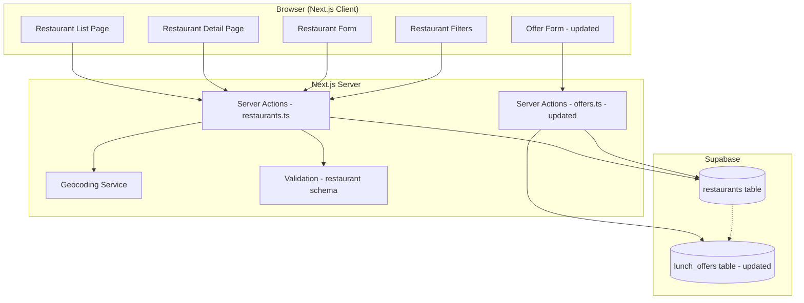
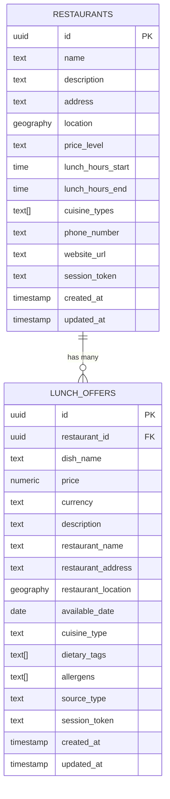

# Design Document: Restaurant Management

## Overview

Funkcjonalność zarządzania restauracjami wprowadza osobną encję `Restaurant` do aplikacji Lunch Agregator. Restauracje będą przechowywane w dedykowanej tabeli z pełnym zestawem metadanych (lokalizacja, poziom cenowy, godziny lunchowe, typ kuchni). Oferty lunchowe mogą być opcjonalnie powiązane z restauracją przez klucz obcy, zachowując jednocześnie kompatybilność wsteczną z istniejącymi ofertami (embedded restaurant data).

### Kluczowe decyzje architektoniczne

- **Nowa tabela `restaurants`** — osobna encja z pełnymi metadanymi, powiązana z ofertami przez opcjonalny FK
- **Snapshot pattern** — przy tworzeniu oferty dane restauracji są kopiowane do oferty (denormalizacja dla stabilności historycznej)
- **Kompatybilność wsteczna** — istniejące oferty bez `restaurant_id` nadal działają poprawnie
- **Anonimowa własność** — identyfikacja właściciela przez `session_token` (jak w istniejących ofertach)
- **PostGIS** — ponowne wykorzystanie istniejącej infrastruktury geolokalizacji
- **Server Actions** — spójne z istniejącą architekturą (Next.js App Router)

## Implementation Notes & Post-Plan Enhancements

> Sekcja synchronizująca dokumentację ze stanem faktycznym po implementacji. Opisuje zmiany i rozszerzenia wprowadzone podczas budowy ponad pierwotny plan.

### Design system (Linear-inspired)

Cała funkcjonalność restauracji oraz istniejące widoki ofert zostały przestylowane zgodnie z systemem `DESIGN-linear-app.md`:
- Paleta przeniesiona na CSS custom properties w `globals.css` (primary `#6366f1`, dark surface `#0f1011`/`#161719`, border `#24282c`, destructive `#eb5757`), border-radius bazowy `0.375rem`.
- Karty z subtelnym cieniem `rgba(0,0,0,0.03)`, hover `brightness-105`.
- Filtry (oferty i restauracje) używają **zawijających się chipów** zamiast checkboxów w sztywnej siatce — rozwiązuje problem nakładających się długich etykiet (np. „Śródziemnomorska") i jest bardziej responsywne.
- Nawigacja: ciemny navbar w stylu Linear.

### Lokalizacja użytkownika (współdzielony stan)

- `useGeolocation` utrwala lokalizację w `localStorage` (klucz `user_location`) wraz z `label` i `source` (`geolocation`/`manual`).
- Synchronizacja między instancjami hooka i kartami przez custom event `user-location-changed` + `storage` event.
- `LocationIndicator` w nagłówku pokazuje aktualną lokalizację i pozwala ją zmienić (GPS / ręczny adres / wyczyść) — zmiana propaguje się natychmiast do list ofert i restauracji.
- Fallback `AddressInput` na stronach gdy GPS odrzucony.

### Menu tygodniowe (batch import ofert)

Rozszerzenie ekstrakcji AI i przepływu dodawania ofert o obsługę menu na cały tydzień:
- Schema AI (`extractedDishSchema`) rozszerzona o pole `dayOfWeek` (mapowanie polskich nazw dni → enum). System prompt zawiera sekcję **WEEKLY MENUS** wymuszającą rozbicie menu na osobne dania per dzień.
- System prompt wymusza też język **polski** dla całego generowanego tekstu (opisy, składniki) niezależnie od języka wejścia — naprawia rozbieżność „opis EN / skład PL".
- `utils/day-of-week.ts` — mapowanie dnia tygodnia na najbliższą nadchodzącą datę (`nextDateForDay`) oraz lista nadchodzących dni dla selektora (`upcomingDays`).
- `WeeklyMenuPreview` — widok podglądu z grupowaniem dań per dzień, wyborem dni do publikacji i zapisem wszystkich naraz.
- `createOffersBatchAction` — tworzy wiele ofert w ramach jednej sesji, zwraca podsumowanie sukcesów/błędów.

### Filtr dnia na liście ofert

- `OfferFilters` rozszerzony o opcjonalne pole `date` (YYYY-MM-DD). `listOffers` używa `filters.date ?? today` zamiast sztywnego „dziś".
- `OffersPage` ma selektor dni (7 dni do przodu: „Dziś", „Jutro", daty) — pozwala przeglądać oferty z menu tygodniowego, które mają przyszłe daty.

### Korekty layoutu

- Usunięto zagnieżdżone `<main>` (layout + strony) powodujące podwójny scroll i błąd semantyczny. Layout dostarcza pojedynczy `<main>`, strony używają `<div>` z własną szerokością/paddingiem.

### Infrastruktura bazy danych

- Migracje uczyniono idempotentnymi (`ADD COLUMN IF NOT EXISTS`, `CREATE INDEX IF NOT EXISTS`).
- Dodano migrację RLS dla `restaurants` (`20240202000000_restaurants_rls.sql`) — polityki zezwalające na SELECT/INSERT/UPDATE/DELETE; kontrola własności realizowana w warstwie aplikacji przez `session_token`.
- `mapOfferToDbRow` pomija `restaurant_id` gdy brak wartości (kompatybilność z bazą przed migracją FK).
- Timeout serwisu AI zwiększony do 30s.

### Znane luki / nie zaimplementowane (zob. backlog w tasks.md)

- **Strona edycji restauracji** (`/restaurants/[id]/edit`) — `RestaurantDetail` linkuje do niej, ale route nie istnieje (akcja `updateRestaurant` gotowa).
- **Strony edycji/usuwania oferty** (`/offers/[id]/edit`, `/offers/[id]/delete`) — linkowane z widoku oferty, brak route'ów.
- **Lista aktywnych ofert na stronie restauracji** (Req 6.5) — obecnie pokazywany jest tylko licznik `activeOffersCount`, nie sama lista ofert.
- **Reverse geocoding** dla GPS — etykieta lokalizacji z GPS to „Bieżąca lokalizacja", nie czytelny adres.


## Architecture

### Diagram komponentów



### Przepływ danych

1. **Tworzenie restauracji**: Client (form) → Server Action → Validation → Geocoding → Supabase INSERT → Response
2. **Edycja restauracji**: Client (form) → Server Action → Ownership check → Validation → Geocoding (if address changed) → Supabase UPDATE → Response
3. **Usuwanie restauracji**: Client (confirm) → Server Action → Ownership check → Snapshot offers → Supabase DELETE → Response
4. **Przeglądanie/filtrowanie**: Client → Server Action → Supabase query (PostGIS + filters) → Response
5. **Powiązanie z ofertą**: Client (select restaurant) → Copy data to offer fields → Standard offer creation flow

## Components and Interfaces

### 1. Nowe strony i komponenty

```typescript
// Nowe strony
app/
├── restaurants/
│   ├── page.tsx                    // Lista restauracji (Server Component)
│   ├── [id]/page.tsx               // Szczegóły restauracji
│   └── new/page.tsx                // Formularz tworzenia restauracji

// Nowe komponenty
components/
├── restaurants/
│   ├── RestaurantCard.tsx          // Karta restauracji na liście
│   ├── RestaurantList.tsx          // Lista z paginacją
│   ├── RestaurantDetail.tsx        // Pełne szczegóły
│   ├── RestaurantForm.tsx          // Formularz tworzenia/edycji
│   ├── RestaurantFilters.tsx       // Panel filtrów
│   ├── RestaurantSelect.tsx        // Dropdown wyboru restauracji (w formularzu oferty)
│   └── LunchHoursInput.tsx         // Komponent inputu godzin lunchowych
```

### 2. Server Actions

```typescript
// actions/restaurants.ts
interface RestaurantActions {
  createRestaurant(data: CreateRestaurantInput): Promise<ActionResult<Restaurant>>;
  updateRestaurant(id: string, data: UpdateRestaurantInput, sessionToken: string): Promise<ActionResult<Restaurant>>;
  deleteRestaurant(id: string, sessionToken: string): Promise<ActionResult<void>>;
  listRestaurants(filters: RestaurantFilters, userLocation?: Coordinates): Promise<PaginatedRestaurants>;
  getRestaurant(id: string): Promise<Restaurant | null>;
  searchRestaurants(query: string): Promise<RestaurantSummary[]>;
}
```

### 3. Interfejsy kluczowe

```typescript
// types/restaurants.ts

type PriceLevel = 'budżetowa' | 'średnia' | 'premium';

interface LunchHours {
  start: string; // HH:MM format, 06:00-18:00
  end: string;   // HH:MM format, 07:00-23:00
}

interface Restaurant {
  id: string;
  name: string;                        // 2-100 characters, required
  description: string | null;          // max 500 characters
  address: string | null;              // max 200 characters
  location: Coordinates | null;        // from geocoding or manual
  priceLevel: PriceLevel | null;
  lunchHours: LunchHours | null;
  cuisineTypes: CuisineType[];         // multiple selections allowed
  phoneNumber: string | null;          // max 20 characters
  websiteUrl: string | null;           // max 500 characters
  sessionToken: string;
  createdAt: string;
  updatedAt: string;
}

interface RestaurantWithDistance extends Restaurant {
  distanceKm: number | null;
  activeOffersCount: number;
}

interface RestaurantSummary {
  id: string;
  name: string;
  address: string | null;
  cuisineTypes: CuisineType[];
}

interface CreateRestaurantInput {
  name: string;
  description?: string;
  address?: string;
  location?: Coordinates;
  priceLevel?: PriceLevel;
  lunchHours?: LunchHours;
  cuisineTypes?: CuisineType[];
  phoneNumber?: string;
  websiteUrl?: string;
  sessionToken: string;
}

interface UpdateRestaurantInput {
  name?: string;
  description?: string | null;
  address?: string | null;
  location?: Coordinates | null;
  priceLevel?: PriceLevel | null;
  lunchHours?: LunchHours | null;
  cuisineTypes?: CuisineType[];
  phoneNumber?: string | null;
  websiteUrl?: string | null;
}

interface RestaurantFilters {
  distance?: { radius: number; from: Coordinates };  // 0.5-25 km
  priceLevels?: PriceLevel[];
  cuisineTypes?: CuisineType[];
  lunchTimeAt?: string;                              // HH:MM - filter restaurants serving at this time
  searchQuery?: string;                              // min 2 characters
  page?: number;
  limit?: number;                                    // max 50
}

interface PaginatedRestaurants {
  restaurants: RestaurantWithDistance[];
  total: number;
  page: number;
  limit: number;
  hasMore: boolean;
}
```

### 4. Aktualizacja formularza oferty

```typescript
// Rozszerzenie istniejącego CreateOfferInput
interface CreateOfferInput {
  // ... existing fields ...
  restaurantId?: string;  // NEW: optional FK to restaurants table
}
```

## Data Models

### Schemat bazy danych



### Migracja SQL

```sql
-- Create restaurants table
CREATE TABLE restaurants (
  id UUID PRIMARY KEY DEFAULT gen_random_uuid(),
  name TEXT NOT NULL CHECK (char_length(name) >= 2 AND char_length(name) <= 100),
  description TEXT CHECK (char_length(description) <= 500),
  address TEXT CHECK (char_length(address) <= 200),
  location GEOGRAPHY(POINT, 4326),
  price_level TEXT CHECK (price_level IN ('budżetowa', 'średnia', 'premium')),
  lunch_hours_start TIME,
  lunch_hours_end TIME,
  cuisine_types TEXT[] DEFAULT '{}',
  phone_number TEXT CHECK (char_length(phone_number) <= 20),
  website_url TEXT CHECK (char_length(website_url) <= 500),
  session_token TEXT NOT NULL,
  created_at TIMESTAMPTZ DEFAULT NOW(),
  updated_at TIMESTAMPTZ DEFAULT NOW(),
  -- Ensure at least address or location is provided
  CONSTRAINT restaurant_has_location CHECK (address IS NOT NULL OR location IS NOT NULL),
  -- Ensure lunch hours are valid if provided
  CONSTRAINT valid_lunch_hours CHECK (
    (lunch_hours_start IS NULL AND lunch_hours_end IS NULL) OR
    (lunch_hours_start IS NOT NULL AND lunch_hours_end IS NOT NULL AND lunch_hours_start < lunch_hours_end)
  )
);

-- Indexes for restaurants
CREATE INDEX idx_restaurants_name ON restaurants(name);
CREATE INDEX idx_restaurants_session ON restaurants(session_token);
CREATE INDEX idx_restaurants_location ON restaurants USING GIST(location);
CREATE INDEX idx_restaurants_price_level ON restaurants(price_level);
CREATE INDEX idx_restaurants_cuisine ON restaurants USING GIN(cuisine_types);
CREATE INDEX idx_restaurants_search ON restaurants USING GIN(
  to_tsvector('simple', coalesce(name, '') || ' ' || coalesce(description, ''))
);

-- Add restaurant_id FK to lunch_offers (nullable for backward compatibility)
ALTER TABLE lunch_offers ADD COLUMN restaurant_id UUID REFERENCES restaurants(id) ON DELETE SET NULL;
CREATE INDEX idx_offers_restaurant ON lunch_offers(restaurant_id);

-- Function to get restaurants within radius
CREATE OR REPLACE FUNCTION get_restaurants_within_radius(
  user_lat DOUBLE PRECISION,
  user_lng DOUBLE PRECISION,
  radius_km DOUBLE PRECISION
)
RETURNS TABLE (
  id UUID,
  name TEXT,
  distance_km DOUBLE PRECISION
) AS $$
BEGIN
  RETURN QUERY
  SELECT
    r.id,
    r.name,
    ROUND((ST_Distance(
      r.location,
      ST_SetSRID(ST_MakePoint(user_lng, user_lat), 4326)::geography
    ) / 1000.0)::numeric, 1)::double precision AS distance_km
  FROM restaurants r
  WHERE r.location IS NOT NULL
    AND ST_DWithin(
      r.location,
      ST_SetSRID(ST_MakePoint(user_lng, user_lat), 4326)::geography,
      radius_km * 1000
    )
  ORDER BY distance_km ASC;
END;
$$ LANGUAGE plpgsql;
```

### Walidacja (Zod schema)

```typescript
import { z } from 'zod';

const timeRegex = /^([01]\d|2[0-3]):([0-5]\d)$/;

export const lunchHoursSchema = z.object({
  start: z.string().regex(timeRegex, 'Format HH:MM wymagany').refine(
    (val) => {
      const [h] = val.split(':').map(Number);
      return h >= 6 && h <= 18;
    },
    'Godzina rozpoczęcia musi być między 06:00 a 18:00'
  ),
  end: z.string().regex(timeRegex, 'Format HH:MM wymagany').refine(
    (val) => {
      const [h] = val.split(':').map(Number);
      return h >= 7 && h <= 23;
    },
    'Godzina zakończenia musi być między 07:00 a 23:00'
  ),
}).refine(
  (data) => data.start < data.end,
  'Godzina rozpoczęcia musi być wcześniejsza niż godzina zakończenia'
);

export const createRestaurantSchema = z.object({
  name: z.string().min(2, 'Nazwa musi mieć co najmniej 2 znaki').max(100, 'Nazwa może mieć maksymalnie 100 znaków'),
  description: z.string().max(500, 'Opis może mieć maksymalnie 500 znaków').optional(),
  address: z.string().max(200, 'Adres może mieć maksymalnie 200 znaków').optional(),
  location: z.object({
    latitude: z.number().min(-90).max(90),
    longitude: z.number().min(-180).max(180),
  }).optional(),
  priceLevel: z.enum(['budżetowa', 'średnia', 'premium']).optional(),
  lunchHours: lunchHoursSchema.optional(),
  cuisineTypes: z.array(z.enum([
    'polska', 'wloska', 'azjatycka', 'meksykanska',
    'amerykanska', 'indyjska', 'srodziemnomorska', 'inne'
  ])).optional(),
  phoneNumber: z.string().max(20, 'Numer telefonu może mieć maksymalnie 20 znaków').optional(),
  websiteUrl: z.string().max(500, 'URL może mieć maksymalnie 500 znaków').url('Nieprawidłowy format URL').optional(),
  sessionToken: z.string().min(1),
}).refine(
  (data) => data.address !== undefined || data.location !== undefined,
  'Wymagany jest adres lub współrzędne geograficzne'
);
```

## Correctness Properties

### Property 1: Restaurant validation — required and optional field constraints

*For any* restaurant creation input, the validation function SHALL: (a) reject inputs where `name` has fewer than 2 or more than 100 characters, or where neither `address` nor `location` is provided; (b) reject inputs where optional `description` exceeds 500 characters, `phone_number` exceeds 20 characters, or `website_url` exceeds 500 characters; (c) accept all inputs satisfying these constraints.

**Validates: Requirements 1.2, 1.3, 1.7**

### Property 2: Lunch hours validation — time format and ordering

*For any* pair of time strings, the lunch hours validation function SHALL: (a) accept pairs where both are valid HH:MM format, start is in range 06:00-18:00, end is in range 07:00-23:00, and start < end; (b) reject all other pairs with an appropriate error message.

**Validates: Requirements 7.1, 7.2, 7.3, 7.4**

### Property 3: Lunch hours display format (round-trip)

*For any* valid LunchHours object (start and end in HH:MM format), the display formatter SHALL produce a string in the format "HH:MM - HH:MM", and parsing that string back SHALL produce the original LunchHours object.

**Validates: Requirements 7.5**

### Property 4: Session-based ownership enforcement for restaurants

*For any* restaurant and any session token, the system SHALL allow edit and delete operations if and only if the provided session token matches the restaurant's stored `session_token`.

**Validates: Requirements 2.3, 3.5**

### Property 5: Restaurant listing — alphabetical sort and pagination limit

*For any* set of restaurants in the database, calling the listing function without filters SHALL return restaurants sorted alphabetically by name (case-insensitive), and the number of returned restaurants SHALL NOT exceed 50.

**Validates: Requirements 4.1**

### Property 6: Distance filter invariant for restaurants

*For any* set of restaurants with locations, any user location, and any radius value between 0.5 and 25 km, all restaurants returned by the distance filter SHALL have a straight-line distance from the user location that is less than or equal to the specified radius.

**Validates: Requirements 5.1**

### Property 7: Price level filter (OR logic)

*For any* set of restaurants and any non-empty subset of price levels, all restaurants returned by the price level filter SHALL have a `price_level` that is a member of the selected subset.

**Validates: Requirements 5.2**

### Property 8: Cuisine type filter (OR logic)

*For any* set of restaurants and any non-empty subset of cuisine types, all restaurants returned by the cuisine filter SHALL have at least one `cuisine_type` that is a member of the selected subset.

**Validates: Requirements 5.3**

### Property 9: Lunch hours time containment filter

*For any* set of restaurants with lunch hours and any query time in HH:MM format, all restaurants returned by the lunch hours filter SHALL have `lunch_hours_start <= query_time` AND `lunch_hours_end >= query_time`.

**Validates: Requirements 5.4**

### Property 10: Text search containment for restaurants

*For any* set of restaurants and any search query of at least 2 characters, all restaurants returned by the search function SHALL have either `name` or `description` containing the query text (case-insensitive partial match).

**Validates: Requirements 5.5**

### Property 11: Combined restaurant filters equal intersection

*For any* set of restaurants and any combination of active filters, the result of applying all filters simultaneously SHALL be a subset of the result of applying each individual filter alone.

**Validates: Requirements 5.6**

### Property 12: Offer snapshot immutability on restaurant update

*For any* restaurant with associated lunch offers, updating the restaurant's name, address, or location SHALL NOT modify the `restaurant_name`, `restaurant_address`, or `restaurant_location` fields of previously created lunch offers.

**Validates: Requirements 6.4**

### Property 13: Auto-populate offer fields from restaurant

*For any* restaurant selected during offer creation, the offer's `restaurant_name` SHALL equal the restaurant's `name`, the offer's `restaurant_address` SHALL equal the restaurant's `address`, and the offer's `restaurant_location` SHALL equal the restaurant's `location`.

**Validates: Requirements 6.2**

### Property 14: Offer data preservation on restaurant deletion

*For any* restaurant with associated lunch offers, after deleting the restaurant, all previously associated offers SHALL retain their `restaurant_name`, `restaurant_address`, and `restaurant_location` values unchanged, and their `restaurant_id` SHALL be set to NULL.

**Validates: Requirements 3.4**

## Error Handling

### Strategia obsługi błędów

| Warstwa | Typ błędu | Obsługa |
|---------|-----------|---------|
| Client | Błąd walidacji formularza | Podświetlenie pól + komunikaty inline (Zod) |
| Client | Brak uprawnień (session mismatch) | Komunikat "Nie masz uprawnień do edycji tej restauracji" |
| Server | Geocoding failure | Zapis restauracji bez współrzędnych + komunikat |
| Server | Duplikat nazwy (opcjonalne ostrzeżenie) | Ostrzeżenie, ale pozwolenie na zapis |
| Server | Supabase connection error | Generyczny komunikat błędu + retry |
| Server | Constraint violation (DB level) | Mapowanie na czytelny komunikat |

### Wzorce obsługi błędów

```typescript
// Reuse existing ActionResult pattern
type ActionResult<T> = 
  | { success: true; data: T }
  | { success: false; error: string; fieldErrors?: Record<string, string> };

// Restaurant-specific error handling
async function createRestaurant(input: CreateRestaurantInput): Promise<ActionResult<Restaurant>> {
  // 1. Validate with Zod
  const validation = createRestaurantSchema.safeParse(input);
  if (!validation.success) {
    return {
      success: false,
      error: 'Nieprawidłowe dane restauracji',
      fieldErrors: mapZodErrors(validation.error),
    };
  }

  // 2. Geocode if address provided and no coordinates
  let location = input.location;
  if (input.address && !location) {
    location = await geocodeAddress(input.address);
    // If geocoding fails, proceed without coordinates
  }

  // 3. Insert into database
  // 4. Return result
}
```

## Testing Strategy

### Podejście

#### 1. Testy property-based (fast-check)

Biblioteka: **fast-check** (TypeScript)

Konfiguracja: minimum 100 iteracji na property test.

Każdy test property-based będzie oznaczony komentarzem:
```typescript
// Feature: restaurant-management, Property {number}: {property_text}
```

Testy property-based pokrywają:
- Walidacja restauracji (Property 1)
- Walidacja godzin lunchowych (Properties 2, 3)
- Ownership enforcement (Property 4)
- Listing sort + pagination (Property 5)
- Filtrowanie restauracji (Properties 6-11)
- Snapshot immutability (Properties 12, 14)
- Auto-populate fields (Property 13)

#### 2. Testy unit (example-based)

Biblioteka: **Vitest**

Pokrywają:
- Geocoding integration (mock)
- UI components rendering
- Edge cases (empty states, confirmation dialogs)
- Restaurant deletion with associated offers

#### 3. Testy integracyjne

- Server Actions z mockowanym Supabase
- Pełny flow: create → edit → delete restaurant
- Powiązanie oferty z restauracją
- Filtrowanie z PostGIS

### Struktura testów

```
__tests__/
├── properties/
│   ├── restaurant-validation.property.test.ts
│   ├── lunch-hours-validation.property.test.ts
│   ├── restaurant-filtering.property.test.ts
│   ├── restaurant-listing.property.test.ts
│   ├── restaurant-ownership.property.test.ts
│   └── restaurant-offer-snapshot.property.test.ts
├── unit/
│   ├── services/
│   │   └── restaurant-service.test.ts
│   ├── components/
│   │   ├── RestaurantForm.test.tsx
│   │   ├── RestaurantList.test.tsx
│   │   └── LunchHoursInput.test.tsx
│   └── utils/
│       └── lunch-hours-formatter.test.ts
└── integration/
    ├── restaurant-crud.test.ts
    └── restaurant-offer-association.test.ts
```
