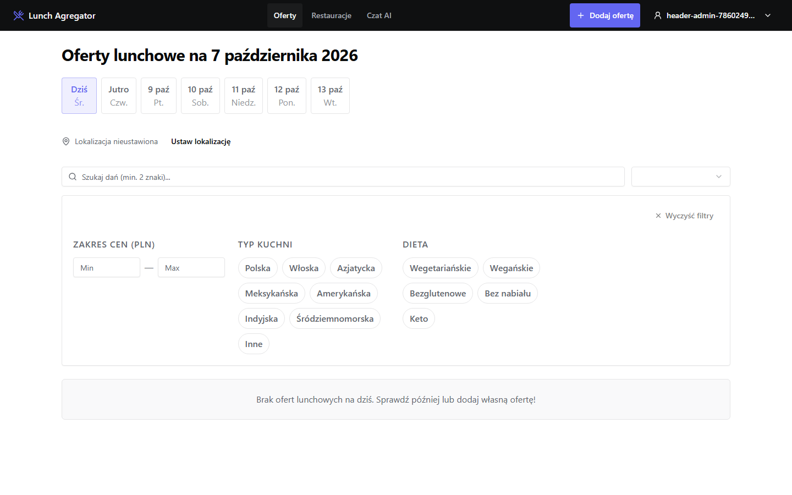
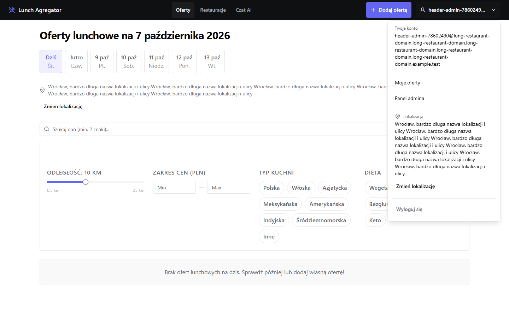
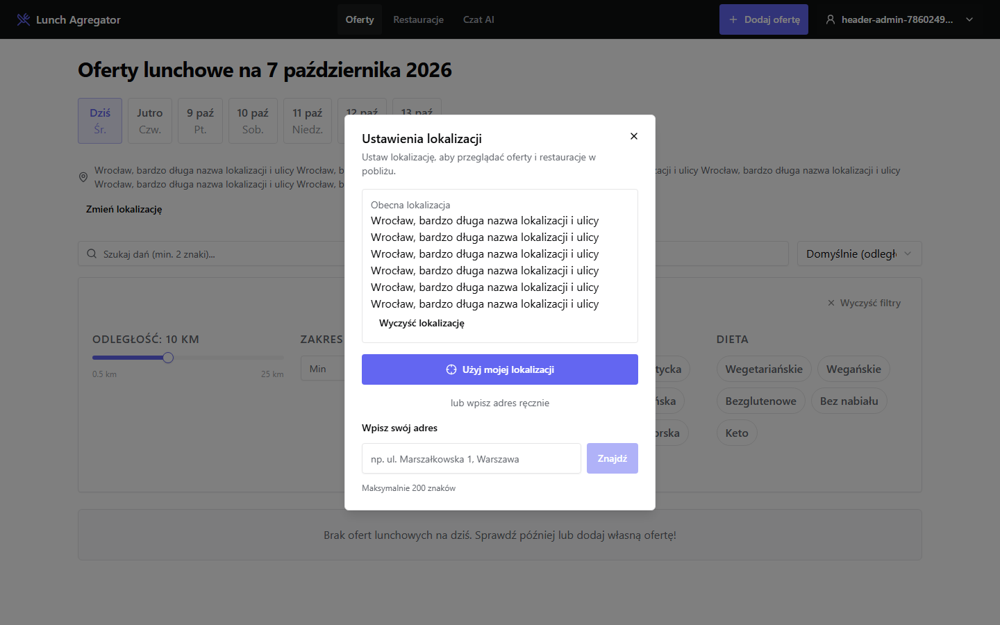
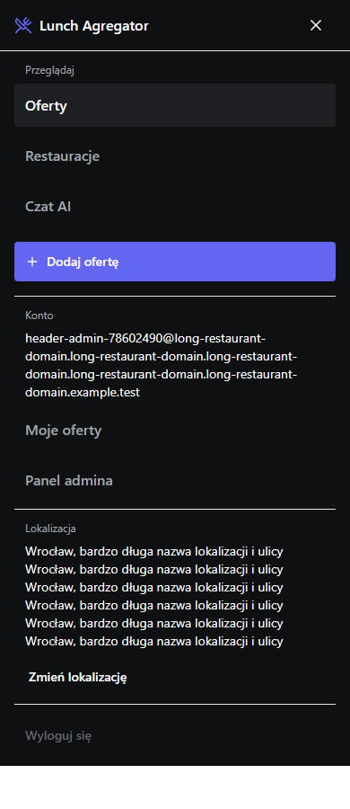

# Issue #93 — header and location verification

Verified on 2026-10-07 against local Supabase and Chromium.

## Result

Desktop navigation keeps Offers, Restaurants and AI chat visible, with a separate add-offer action. A bounded profile trigger opens account identity, personal/admin navigation, location and logout in that order. Below the existing 1440px breakpoint, the hamburger exposes the same groups.

Visitors can change location without authentication. Offer and Restaurant browsing now display location status and a direct change action immediately above the filters. All controls use the existing location hook and httpOnly-cookie persistence; one reusable modal handles manual addresses, GPS, clearing and errors.

The account popup is a navigation disclosure with ordinary links/buttons, Tab navigation and ArrowUp/ArrowDown/Home/End shortcuts. The location modal traps focus. Escape restores focus to the profile, hamburger or browsing-context trigger. Location opens after dismissing account/mobile navigation.

## Checks

- Focused unit/property tests: **28 passed** across 9 files, including the navigation regressions from #87 and 100 generated SSR/hydration cases.
- Dedicated Chromium E2E: **6 passed**, with real local User/Admin sessions and fixture cleanup.
- Widths: **320, 390, 768, 1000, 1023, 1024, 1280, 1440, 1920 CSS px** for Visitor, User and Admin. Long emails/location labels and open navigation/location dialogs had no horizontal document overflow.
- E2E covers unset location, role-specific links, authentication return URLs, keyboard focus/shortcuts, outside profile dismissal, navigation and resize dismissal, mobile logout, GPS persistence, clearing and cross-page synchronization.
- Unit tests additionally cover manual address resolution, cross-control synchronization, failed geocoding and GPS denial.
- `npm run typecheck`: passed.
- `npm run build`: passed, with existing unused-variable warnings outside the changed components.
- Full `npm test`: **857 passed, 3 skipped, 1 failed**. The unchanged `src/actions/offers.batch.test.ts:79` expects `/restaurant name/i`, while the unchanged validator returns `Podaj nazwę restauracji.`. Both expectations/messages exist in `origin/main`; this PR does not change batch publication or its validation.

Browser automation was also used to inspect the Visitor's mobile menu and location dialog, Escape/focus restoration at 320px, and desktop navigation at 1440px.

No Restaurant or Lunch_Offer fixtures were written. Temporary authentication fixtures were deleted. No production writes or deployment were performed.

## Layout evidence

The screenshots deliberately use unusually long fixture email/location values.

### Desktop, 1440px



### Profile expanded, 1440px



### Location dialog, 1440px



### Mobile expanded, 390px



## Reproduce

Start the app and local Supabase with `NEXT_PUBLIC_SUPABASE_URL=http://127.0.0.1:54321`.
Expose the local anon key as `NEXT_PUBLIC_SUPABASE_ANON_KEY` and service-role key as `TEST_SUPABASE_SERVICE_ROLE_KEY` to the test process.

```text
npm test -- src/components/Nav src/components/AccountMenu src/components/location __tests__/unit/components/offers/OffersPage
npx playwright test __tests__/e2e/header-account-menu.spec.ts --project=chromium --workers=1
npm run typecheck
npm run build
```

Authenticated E2E cases are gated to loopback Supabase on port 54321. Screenshot capture normally writes Playwright artifacts; set `HEADER_MENU_SCREENSHOTS=1` to regenerate this document's images. Live geocoding is covered at the UI boundary by unit fixtures; E2E does not depend on an external geocoding provider.
